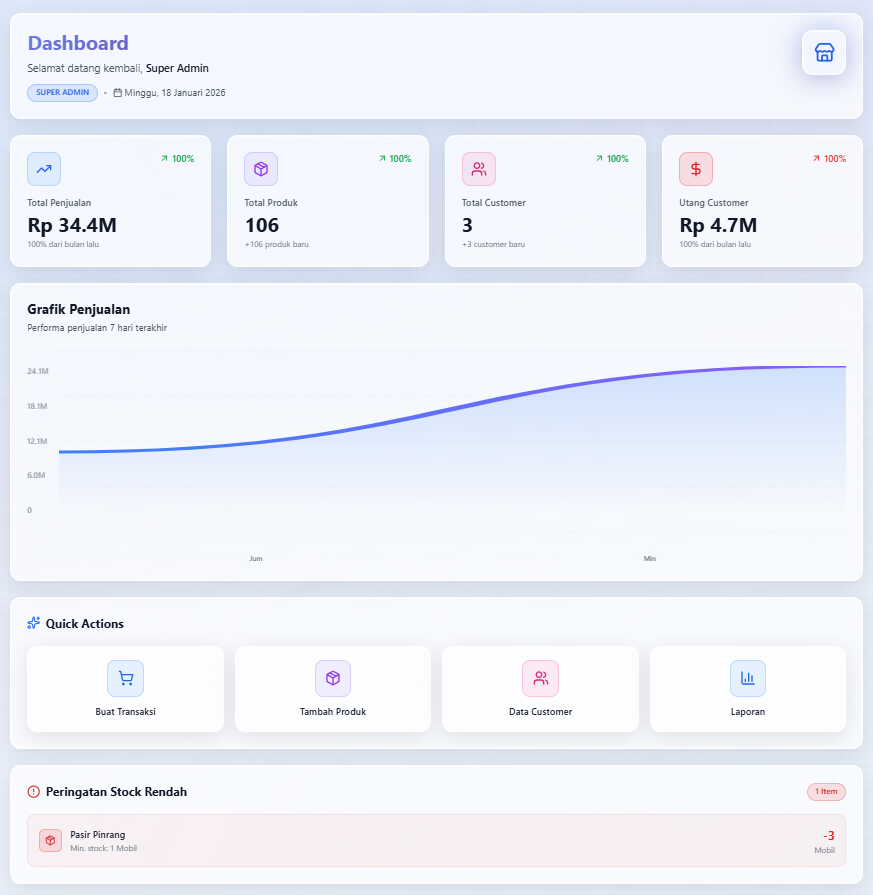
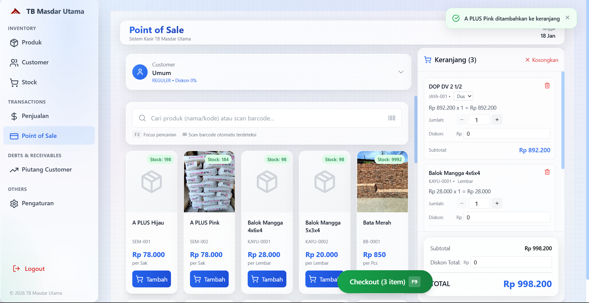
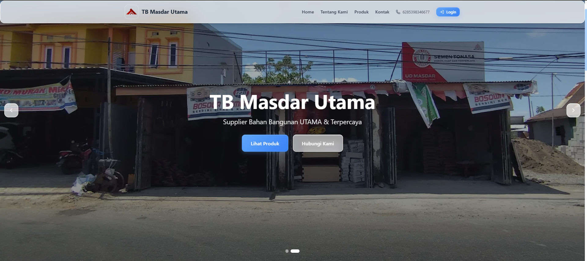

<!-- LOGO -->
<p align="center">
  
</p>

<h1 align="center">
  <span style="background: linear-gradient(90deg,#2563eb,#a78bfa); color: white; padding: 8px 24px; border-radius: 16px; box-shadow: 0 4px 32px #2563eb33;">TB Masdar Utama</span>
</h1>

<p align="center">
  <b>Point of Sale & Inventory Management System</b> <br>
  
  
  
  
  
</p>

---

>   
> <b>TB Masdar Utama</b> adalah aplikasi kasir modern berbasis web dengan fitur lengkap untuk toko bangunan, grosir, dan retail.  
> Dirancang dengan tampilan <b>glassmorphism</b> yang elegan dan responsif.

---

## ✨ Fitur Utama

- **Point of Sale (POS)**
  - Transaksi kasir cepat, diskon, pembayaran tunai/kredit
  - Cetak & download invoice
- **Manajemen Produk**
  - Multi satuan, harga jual & beli, stok minimum, upload gambar produk (Cloudflare R2)
- **Manajemen Stok**
  - Mutasi stok otomatis, log pergerakan stok, notifikasi stok menipis
- **Manajemen Pelanggan & Supplier**
  - Data pelanggan, supplier, utang/piutang, riwayat transaksi
- **Pembelian & Penjualan**
  - Input pembelian, retur, laporan penjualan harian/bulanan
- **Pengiriman (Delivery Order)**
  - Generate DO, update status pengiriman
- **Laporan & Statistik**
  - Laporan penjualan, pembelian, stok, keuangan, utang/piutang
- **Manajemen User & Role**
  - Hak akses: Super Admin, Admin, Kasir
- **Landing Page Publik**
  - Showcase produk, kontak, fitur, dan login kasir/admin
- **Setting Toko**
  - Logo, alamat, kontak, rekening bank, sosial media

---

## 🖼️ Tampilan (Glassmorphism UI)

> Semua tampilan menggunakan efek glass-card, shadow, dan warna gradien biru-ungu yang modern.

| Dashboard Kasir | POS (Transaksi) | Landing Page |
|---|---|---|
|  |  |  |

---

## 🚀 Teknologi

- **Next.js 14** (App Router, SSR/SSG, API Route)
- **Prisma ORM** (Type-safe DB)
- **Supabase PostgreSQL** (Cloud DB)
- **Cloudflare R2** (Image Storage)
- **Tailwind CSS** (Glassmorphism, Responsive)
- **NextAuth.js** (Authentication)
- **Lucide Icons** (UI Icon)
- **Vercel** (Deployment)

---

## ⚡️ Instalasi & Setup

### 1. Clone Project
```bash
git clone https://github.com/yourusername/tbmasdarutama.git
cd tbmasdarutama
```

### 2. Install Dependencies
```bash
npm install
```

### 3. Konfigurasi Environment
Buat file `.env` dan isi dengan:
```env
# DATABASE_URL="sesuaikan"
NEXTAUTH_URL="http://localhost:3000"
NEXTAUTH_SECRET="sesuaikan"
NODE_ENV="sesuaikan"
#  Cloudflare R2 Configuration
CLOUDFLARE_WORKER_URL="sesuaikan"
NODE_TLS_REJECT_UNAUTHORIZED=0

# ==================== EMAIL CONFIGURATION ====================
EMAIL_HOST=smtp.gmail.com
EMAIL_PORT=465
EMAIL_USER=sesuaikan
EMAIL_PASSWORD=sesuaikan
EMAIL_FROM=sesuaikan
EMAIL_FROM_NAME=sesuaikan

# App URL
NEXT_PUBLIC_APP_URL=http://localhost:3000
```
> **Note:** Gunakan Session Pooler Supabase (port 6543) untuk koneksi dari Vercel.

### 4. Migrasi Database
```bash
npx prisma migrate deploy
# atau untuk dev:
npx prisma migrate dev
```

### 5. Jalankan Development
```bash
npm run dev
```

### 6. Deploy ke Vercel
- Push ke GitHub, lalu connect repo ke Vercel.
- Pastikan environment variable di Vercel sudah diisi.

---

## 🔑 Hak Akses & Role

| Role         | Fitur Dashboard         | POS | Penjualan | Setting | Laporan |
|--------------|------------------------|-----|-----------|---------|---------|
| Super Admin  | Semua                  | ✅  | ✅        | ✅      | ✅      |
| Admin        | Semua kecuali user mgmt| ✅  | ✅        | ✅      | ✅      |
| Kasir        | POS & transaksi saja   | ✅  | ❌        | ❌      | ❌      |

---

## 🛠️ Struktur Folder

```
src
 ┣ app
 ┃ ┣ (public)
 ┃ ┃ ┣ layout.tsx
 ┃ ┃ ┗ page.tsx
 ┃ ┣ api
 ┃ ┃ ┣ auth
 ┃ ┃ ┃ ┗ [...nextauth]
 ┃ ┃ ┃ ┃ ┗ route.ts
 ┃ ┃ ┣ settings
 ┃ ┃ ┃ ┗ request-reset
 ┃ ┃ ┃ ┃ ┗ route.ts
 ┃ ┃ ┗ upload
 ┃ ┃ ┃ ┗ route.ts
 ┃ ┣ dashboard
 ┃ ┃ ┣ categories
 ┃ ┃ ┃ ┣ _components
 ┃ ┃ ┃ ┃ ┣ CategoryFormModal.tsx
 ┃ ┃ ┃ ┃ ┣ CategoryTable.tsx
 ┃ ┃ ┃ ┃ ┣ DeleteCategoryDialog.tsx
 ┃ ┃ ┃ ┃ ┣ DeleteSubCategoryDialog.tsx
 ┃ ┃ ┃ ┃ ┣ SubCategoryFormModal.tsx
 ┃ ┃ ┃ ┃ ┗ SubCategoryList.tsx
 ┃ ┃ ┃ ┗ page.tsx
 ┃ ┃ ┣ customer-debts
 ┃ ┃ ┃ ┣ _components
 ┃ ┃ ┃ ┃ ┣ CustomerDebtClient.tsx
 ┃ ┃ ┃ ┃ ┣ CustomerDebtStats.tsx
 ┃ ┃ ┃ ┃ ┣ CustomerDebtTable.tsx
 ┃ ┃ ┃ ┃ ┣ DebtDetailModal.tsx
 ┃ ┃ ┃ ┃ ┣ DebtStatusBadge.tsx
 ┃ ┃ ┃ ┃ ┣ DeleteDebtDialog.tsx
 ┃ ┃ ┃ ┃ ┗ PaymentModal.tsx
 ┃ ┃ ┃ ┗ page.tsx
 ┃ ┃ ┣ customers
 ┃ ┃ ┃ ┣ _components
 ┃ ┃ ┃ ┃ ┣ CustomerFormModal.tsx
 ┃ ┃ ┃ ┃ ┣ CustomersClient.tsx
 ┃ ┃ ┃ ┃ ┣ CustomerStats.tsx
 ┃ ┃ ┃ ┃ ┣ CustomerTable.tsx
 ┃ ┃ ┃ ┃ ┣ CustomerViewModal.tsx
 ┃ ┃ ┃ ┃ ┗ DeleteCustomerDialog.tsx
 ┃ ┃ ┃ ┗ page.tsx
 ┃ ┃ ┣ delivery-orders
 ┃ ┃ ┃ ┣ _components
 ┃ ┃ ┃ ┃ ┣ DeleteDeliveryDialog.tsx
 ┃ ┃ ┃ ┃ ┣ DeliveryOrderClient.tsx
 ┃ ┃ ┃ ┃ ┣ DeliveryOrderDetailModal.tsx
 ┃ ┃ ┃ ┃ ┣ DeliveryOrderFormModal.tsx
 ┃ ┃ ┃ ┃ ┣ DeliveryOrderStats.tsx
 ┃ ┃ ┃ ┃ ┣ DeliveryOrderTable.tsx
 ┃ ┃ ┃ ┃ ┗ ReceiveDeliveryModal.tsx
 ┃ ┃ ┃ ┗ page.tsx
 ┃ ┃ ┣ pos
 ┃ ┃ ┃ ┣ _components
 ┃ ┃ ┃ ┃ ┣ CartItem.tsx
 ┃ ┃ ┃ ┃ ┣ CartSummary.tsx
 ┃ ┃ ┃ ┃ ┣ CustomerSelector.tsx
 ┃ ┃ ┃ ┃ ┣ InvoicePreview.tsx
 ┃ ┃ ┃ ┃ ┣ PaymentModal.tsx
 ┃ ┃ ┃ ┃ ┣ POSKeyboardShortcuts.tsx
 ┃ ┃ ┃ ┃ ┣ POSLayout.tsx
 ┃ ┃ ┃ ┃ ┣ ProductCard.tsx
 ┃ ┃ ┃ ┃ ┣ ProductGrid.tsx
 ┃ ┃ ┃ ┃ ┣ ProductSearch.tsx
 ┃ ┃ ┃ ┃ ┣ QuickAddCustomer.tsx
 ┃ ┃ ┃ ┃ ┗ ShoppingCart.tsx
 ┃ ┃ ┃ ┗ page.tsx
 ┃ ┃ ┣ products
 ┃ ┃ ┃ ┣ _components
 ┃ ┃ ┃ ┃ ┣ DeleteProductDialog.tsx
 ┃ ┃ ┃ ┃ ┣ ProductFormModal.tsx
 ┃ ┃ ┃ ┃ ┣ ProductImageDisplay.tsx
 ┃ ┃ ┃ ┃ ┣ ProductImageUploader.tsx
 ┃ ┃ ┃ ┃ ┣ ProductsClient.tsx
 ┃ ┃ ┃ ┃ ┣ ProductStats.tsx
 ┃ ┃ ┃ ┃ ┣ ProductStockBadge.tsx
 ┃ ┃ ┃ ┃ ┣ ProductTable.tsx
 ┃ ┃ ┃ ┃ ┣ ProductUnitDisplay.tsx
 ┃ ┃ ┃ ┃ ┣ ProductUnitManager.tsx
 ┃ ┃ ┃ ┃ ┗ ProductViewModal.tsx
 ┃ ┃ ┃ ┗ page.tsx
 ┃ ┃ ┣ purchases
 ┃ ┃ ┃ ┣ _components
 ┃ ┃ ┃ ┃ ┣ DeletePurchaseDialog.tsx
 ┃ ┃ ┃ ┃ ┣ PurchaseFormModal.tsx
 ┃ ┃ ┃ ┃ ┣ PurchasesClient.tsx
 ┃ ┃ ┃ ┃ ┣ PurchaseStats.tsx
 ┃ ┃ ┃ ┃ ┣ PurchaseStatusBadge.tsx
 ┃ ┃ ┃ ┃ ┣ PurchaseTable.tsx
 ┃ ┃ ┃ ┃ ┣ PurchaseViewModal.tsx
 ┃ ┃ ┃ ┃ ┗ ReceivePurchaseModal.tsx
 ┃ ┃ ┃ ┗ page.tsx
 ┃ ┃ ┣ reports
 ┃ ┃ ┃ ┣ debts
 ┃ ┃ ┃ ┃ ┣ _components
 ┃ ┃ ┃ ┃ ┃ ┗ DebtsReportContent.tsx
 ┃ ┃ ┃ ┃ ┗ page.tsx
 ┃ ┃ ┃ ┣ financial
 ┃ ┃ ┃ ┃ ┣ _components
 ┃ ┃ ┃ ┃ ┃ ┗ FinancialReportContent.tsx
 ┃ ┃ ┃ ┃ ┗ page.tsx
 ┃ ┃ ┃ ┣ inventory
 ┃ ┃ ┃ ┃ ┣ _components
 ┃ ┃ ┃ ┃ ┃ ┗ InventoryReportContent.tsx
 ┃ ┃ ┃ ┃ ┗ page.tsx
 ┃ ┃ ┃ ┣ products
 ┃ ┃ ┃ ┃ ┣ _components
 ┃ ┃ ┃ ┃ ┃ ┗ ProductsReportContent.tsx
 ┃ ┃ ┃ ┃ ┗ page.tsx
 ┃ ┃ ┃ ┣ purchases
 ┃ ┃ ┃ ┃ ┣ _components
 ┃ ┃ ┃ ┃ ┃ ┗ PurchasesReportContent.tsx
 ┃ ┃ ┃ ┃ ┗ page.tsx
 ┃ ┃ ┃ ┣ sales
 ┃ ┃ ┃ ┃ ┣ _components
 ┃ ┃ ┃ ┃ ┃ ┗ SalesReportContent.tsx
 ┃ ┃ ┃ ┃ ┗ page.tsx
 ┃ ┃ ┃ ┣ _components
 ┃ ┃ ┃ ┃ ┣ DateRangeFilter.tsx
 ┃ ┃ ┃ ┃ ┣ ReportDownloadButton.tsx
 ┃ ┃ ┃ ┃ ┣ ReportHeader.tsx
 ┃ ┃ ┃ ┃ ┗ ReportLayout.tsx
 ┃ ┃ ┃ ┗ page.tsx
 ┃ ┃ ┣ sales
 ┃ ┃ ┃ ┣ _components
 ┃ ┃ ┃ ┃ ┣ DeleteSaleDialog.tsx
 ┃ ┃ ┃ ┃ ┣ PaymentMethodBadge.tsx
 ┃ ┃ ┃ ┃ ┣ SaleFormModal.tsx
 ┃ ┃ ┃ ┃ ┣ SaleInvoicePDF.tsx
 ┃ ┃ ┃ ┃ ┣ SalesStats.tsx
 ┃ ┃ ┃ ┃ ┣ SalesTable.tsx
 ┃ ┃ ┃ ┃ ┣ SaleStatusBadge.tsx
 ┃ ┃ ┃ ┃ ┗ SaleViewModal.tsx
 ┃ ┃ ┃ ┗ page.tsx
 ┃ ┃ ┣ settings
 ┃ ┃ ┃ ┣ _components
 ┃ ┃ ┃ ┃ ┣ HeroImageManager.tsx
 ┃ ┃ ┃ ┃ ┣ LandingPageTab.tsx
 ┃ ┃ ┃ ┃ ┣ PasswordSettingsTab.tsx
 ┃ ┃ ┃ ┃ ┗ StoreSettingsTab.tsx
 ┃ ┃ ┃ ┗ page.tsx
 ┃ ┃ ┣ stocks
 ┃ ┃ ┃ ┣ _components
 ┃ ┃ ┃ ┃ ┣ DeleteStockDialog.tsx
 ┃ ┃ ┃ ┃ ┣ LowStockAlert.tsx
 ┃ ┃ ┃ ┃ ┣ StockAdjustmentModal.tsx
 ┃ ┃ ┃ ┃ ┣ StockClient.tsx
 ┃ ┃ ┃ ┃ ┣ StockHistoryModal.tsx
 ┃ ┃ ┃ ┃ ┣ StockStats.tsx
 ┃ ┃ ┃ ┃ ┗ StockTable.tsx
 ┃ ┃ ┃ ┗ page.tsx
 ┃ ┃ ┣ supplier-debts
 ┃ ┃ ┃ ┣ _component
 ┃ ┃ ┃ ┃ ┣ DebtDetailModal.tsx
 ┃ ┃ ┃ ┃ ┣ DeleteDebtDialog.tsx
 ┃ ┃ ┃ ┃ ┣ PaymentModal.tsx
 ┃ ┃ ┃ ┃ ┣ SupplierDebtClient.tsx
 ┃ ┃ ┃ ┃ ┣ SupplierDebtStats.tsx
 ┃ ┃ ┃ ┃ ┗ SupplierDebtTable.tsx
 ┃ ┃ ┃ ┗ page.tsx
 ┃ ┃ ┣ suppliers
 ┃ ┃ ┃ ┣ _components
 ┃ ┃ ┃ ┃ ┣ DeleteSupplierDialog.tsx
 ┃ ┃ ┃ ┃ ┣ SupplierFormModal.tsx
 ┃ ┃ ┃ ┃ ┣ SupplierStatusBadge.tsx
 ┃ ┃ ┃ ┃ ┗ SupplierTable.tsx
 ┃ ┃ ┃ ┗ page.tsx
 ┃ ┃ ┣ units
 ┃ ┃ ┃ ┣ _components
 ┃ ┃ ┃ ┃ ┣ DeleteUnitDialog.tsx
 ┃ ┃ ┃ ┃ ┣ UnitFormModal.tsx
 ┃ ┃ ┃ ┃ ┗ UnitTable.tsx
 ┃ ┃ ┃ ┗ page.tsx
 ┃ ┃ ┣ users
 ┃ ┃ ┃ ┣ _components
 ┃ ┃ ┃ ┃ ┣ DeleteUserDialog.tsx
 ┃ ┃ ┃ ┃ ┣ UserFormModal.tsx
 ┃ ┃ ┃ ┃ ┣ UsersClient.tsx
 ┃ ┃ ┃ ┃ ┗ UserTable.tsx
 ┃ ┃ ┃ ┗ page.tsx
 ┃ ┃ ┣ _components
 ┃ ┃ ┃ ┗ Sidebar.tsx
 ┃ ┃ ┣ layout.tsx
 ┃ ┃ ┗ page.tsx
 ┃ ┣ forgot-password
 ┃ ┃ ┗ page.tsx
 ┃ ┣ login
 ┃ ┃ ┣ LoginForm.tsx
 ┃ ┃ ┗ page.tsx
 ┃ ┣ reset-password
 ┃ ┃ ┗ page.tsx
 ┃ ┣ _components
 ┃ ┃ ┣ LandingAbout.tsx
 ┃ ┃ ┣ LandingContact.tsx
 ┃ ┃ ┣ LandingFeatures.tsx
 ┃ ┃ ┣ LandingFooter.tsx
 ┃ ┃ ┣ LandingHero.tsx
 ┃ ┃ ┣ LandingNavbar.tsx
 ┃ ┃ ┗ LandingProducts.tsx
 ┃ ┣ favicon.ico
 ┃ ┣ globals.css
 ┃ ┗ layout.tsx
 ┣ components
 ┃ ┗ ui
 ┃ ┃ ┗ toast.tsx
 ┣ lib
 ┃ ┣ actions
 ┃ ┃ ┣ auth.actions.ts
 ┃ ┃ ┣ category.actions.ts
 ┃ ┃ ┣ customer-debt.actions.ts
 ┃ ┃ ┣ customer.actions.ts
 ┃ ┃ ┣ dashboard.actions.ts
 ┃ ┃ ┣ delivery-order.actions.ts
 ┃ ┃ ┣ landing-page.actions.ts
 ┃ ┃ ┣ landing-public.actions.ts
 ┃ ┃ ┣ password-reset.actions.ts
 ┃ ┃ ┣ pos.actions.ts
 ┃ ┃ ┣ product.actions.ts
 ┃ ┃ ┣ purchase.actions.ts
 ┃ ┃ ┣ report.actions.ts
 ┃ ┃ ┣ sale.actions.ts
 ┃ ┃ ┣ stock.actions.ts
 ┃ ┃ ┣ store-setting.actions.ts
 ┃ ┃ ┣ supplier-debt.actions.ts
 ┃ ┃ ┣ supplier.actions.ts
 ┃ ┃ ┣ unit.actions.ts
 ┃ ┃ ┗ user.actions.ts
 ┃ ┣ constants
 ┃ ┃ ┗ company.ts
 ┃ ┣ utils
 ┃ ┃ ┣ delivery-order-generator.ts
 ┃ ┃ ┣ email.ts
 ┃ ┃ ┣ invoice-generator.ts
 ┃ ┃ ┣ invoice-printer.ts
 ┃ ┃ ┣ pdf-generator.ts
 ┃ ┃ ┣ pdf-helpers.ts
 ┃ ┃ ┣ pos-helpers.ts
 ┃ ┃ ┗ role.ts
 ┃ ┣ validations
 ┃ ┃ ┣ category.schema.ts
 ┃ ┃ ┣ customer-debt.schema.ts
 ┃ ┃ ┣ customer.schema.ts
 ┃ ┃ ┣ delivery-order.schema.ts
 ┃ ┃ ┣ landing-page.schema.ts
 ┃ ┃ ┣ password-reset.schema.ts
 ┃ ┃ ┣ product.schema.ts
 ┃ ┃ ┣ purchase.schema.ts
 ┃ ┃ ┣ sale.schema.ts
 ┃ ┃ ┣ stock.schema.ts
 ┃ ┃ ┣ store-setting.schema.ts
 ┃ ┃ ┣ supplier-debt.schema.ts
 ┃ ┃ ┣ supplier.schema.ts
 ┃ ┃ ┣ unit.schema.ts
 ┃ ┃ ┗ user.schema.ts
 ┃ ┣ auth.ts
 ┃ ┣ prisma.ts
 ┃ ┗ utils.ts
 ┣ types
 ┃ ┣ css.d.ts
 ┃ ┣ customer-debt.ts
 ┃ ┣ delivery-order.ts
 ┃ ┣ env.d.ts
 ┃ ┣ next-auth.d.ts
 ┃ ┣ pos.ts
 ┃ ┣ purchase.ts
 ┃ ┣ sale.ts
 ┃ ┣ settings.ts
 ┃ ┗ supplier-debt.ts
 ┗ middleware.ts
prisma
 ┣ migrations
 ┣ schema.prisma
 ┗ seed.sql
public
```

---

## 📦 Fitur Lain

- **Upload gambar produk** ke Cloudflare R2
- **Responsive** (mobile & desktop)
- **Glassmorphism** di semua card & modal
- **Revalidate data otomatis** setelah transaksi
- **Custom toast notification**

---

## 💡 Tips Penggunaan

- **Kasir** hanya bisa akses POS, tidak bisa lihat menu penjualan.
- **Logo & info toko** diambil otomatis dari pengaturan (bisa diubah di dashboard).
- **Landing page** dan **login** mengambil data logo dari action publik, tanpa permission.

---

## 🧑‍💻 Kontribusi

1. Fork repo ini
2. Buat branch baru (`feature/fitur-baru`)
3. Commit & push perubahan
4. Buat Pull Request

---

## 📞 Kontak & Bantuan

- Email: tbmasdarutama@gmail.com
- WhatsApp: 08xxxxxxxxxx
- [Landing Page](https://tb-masdarutama.vercel.app)

---

> <span style="background:rgba(255,255,255,0.6);padding:8px 16px;border-radius:12px;box-shadow:0 2px 16px #2563eb22;">  
> Dibuat dengan ❤️ oleh Tim TB Masdar Utama  
> </span>
```